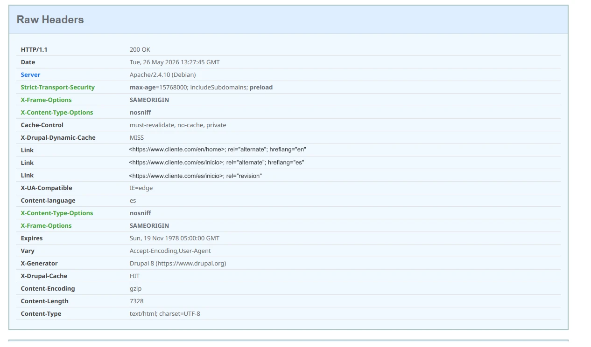
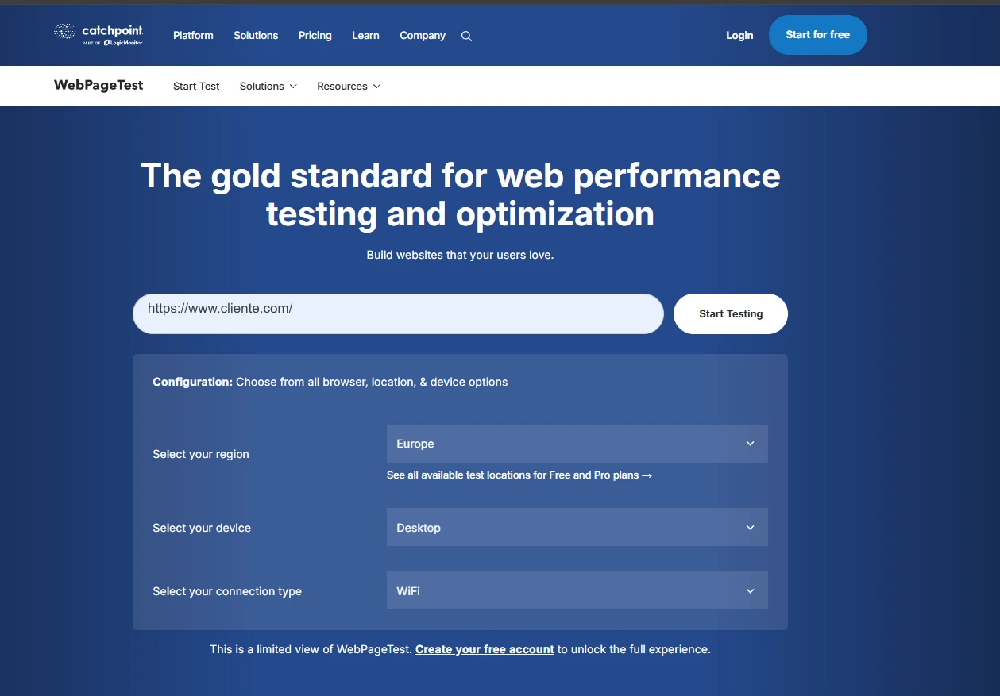

# Metodología y Herramientas de Análisis — cliente.com

> **Fecha del análisis:** 26 de mayo de 2026
> **Propósito de este documento:** Registrar qué herramientas se utilizaron en cada área del
> análisis, cómo reproducir los resultados, y qué alternativas públicas existen para cada tipo
> de auditoría. Sirve tanto de log del proceso como de guía reutilizable para auditar cualquier
> web.

---

## Enfoque y condiciones del análisis

Este análisis se realizó **sin acceso al servidor, sin credenciales y sin ningún tipo de relación comercial previa con Cliente**. Todo lo documentado fue obtenido mediante:

- **Herramientas públicas** — PageSpeed Insights, SSL Labs, SecurityHeaders.com, WAVE, Wappalyzer, Google Rich Results Test, opengraph.xyz
- **Inspección pasiva** — cabeceras HTTP, código fuente HTML, archivos CSS/JS públicos, `robots.txt`, `CHANGELOG.txt`
- **Línea de comandos** — `curl` para verificar respuestas del servidor sin intermediarios

No se realizó ningún tipo de escaneo activo, fuzzing ni acceso a rutas no públicas. El análisis es equivalente a lo que cualquier usuario técnico con acceso al navegador y a una terminal puede obtener de cualquier web pública.

### Tooling de IA — flujo de trabajo de alto rendimiento

El análisis incorpora **configuraciones avanzadas de agentes, skills y comandos de IA** desarrolladas en proyectos propios sobre [OpenCode](https://opencode.ai/) y [Claude Code](https://claude.ai/code). Estas configuraciones se mantienen en repositorios privados en [GitHub](https://github.com/bpstack) y permiten integrar análisis técnico, síntesis de hallazgos y generación de documentación en un flujo de trabajo eficiente.

Las herramientas de IA no trabajan de forma autónoma — el valor está en **definir las directrices correctas para cada situación y proyecto**. El conocimiento técnico del analista es el que determina qué preguntar, cómo interpretar los resultados y qué decisiones tomar. La IA acelera el proceso; el criterio es humano.

Los repositorios de configuración están disponibles para revisión por parte del equipo técnico de Cliente si fuera de interés.

---

## Cómo se estructuró el análisis

El análisis de cliente.com se dividió en cuatro áreas independientes, cada una con sus propias
herramientas:

| Área           | Informe                    | Herramientas principales usadas                  |
| -------------- | -------------------------- | ------------------------------------------------ |
| Stack técnico  | `01-stack.md`              | `curl`, Wappalyzer, inspección HTML/CSS/JS        |
| Rendimiento    | `02-rendimiento.md`        | Google PageSpeed Insights, Chrome DevTools        |
| Seguridad      | `03-seguridad.md`          | `curl`, SecurityHeaders.com, CVE databases        |
| Accesibilidad  | `04-accesibilidad.md`      | Lighthouse, inspección HTML, WAVE                 |
| SEO/Analytics  | `05-seo.md`                | Lighthouse, inspección HTML, Open Graph checkers  |

---

## 1. Herramientas de Línea de Comandos

### `curl`

La herramienta más directa para inspeccionar una web sin que el navegador procese nada. Se usó
extensivamente para obtener cabeceras HTTP reales del servidor.

**Comandos utilizados:**

```bash
# Ver todas las cabeceras HTTP de respuesta
curl -I https://www.cliente.com/

# Seguir redirecciones y ver cada paso
curl -IL https://www.cliente.com/

# Ver cabeceras + primeros bytes del cuerpo (para detectar CMS por meta tags)
curl -s https://www.cliente.com/ | head -100

# Verificar si un archivo sensible está expuesto
curl -I https://www.cliente.com/core/CHANGELOG.txt

# Ver cabeceras con verbose completo (handshake TLS incluido)
curl -v https://www.cliente.com/ 2>&1 | grep -E "^[<>]"
```

**Qué reveló `curl` en este análisis:**

- `Server: Apache/2.4.10 (Debian)` → versión de Apache de 2014
- `X-Generator: Drupal 8` → CMS y versión exacta
- `X-Drupal-Cache: HIT` → sistema de caché interno
- `Strict-Transport-Security` → HSTS configurado correctamente
- `X-Frame-Options: SAMEORIGIN` → protección clickjacking activa
- Ausencia de `Content-Security-Policy`, `Referrer-Policy`, `Permissions-Policy`

**Alternativa web equivalente:** SecurityHeaders.com (ver sección 3.1)



---

## 2. Herramientas de Rendimiento

### 2.1 Google PageSpeed Insights

**URL:** https://pagespeed.web.dev

**Qué mide:** Ejecuta Lighthouse contra la URL indicada desde los servidores de Google,
simulando un dispositivo móvil real (Moto G Power con red 4G limitada) y un desktop. Devuelve:

- Puntuaciones de Performance, Accesibilidad, Best Practices y SEO (0–100)
- Core Web Vitals: LCP, FCP, CLS, TBT, Speed Index
- Listado de oportunidades de mejora con estimación de ahorro
- Diagnósticos detallados por recurso

**Cómo se usó:** Análisis de la home y la página `/es/empresas` en ambos modos (mobile/desktop).
Fue la fuente de los scores del `02-rendimiento.md` y `04-accesibilidad.md`.

**Limitación importante:** Solo analiza lo que Lighthouse puede medir desde fuera. No tiene acceso
al servidor, a la base de datos, ni a los logs. Los datos de campo reales (CrUX) no estaban
disponibles para cliente.com por falta de tráfico suficiente en el dataset público de Google.

---

### 2.2 Chrome DevTools — Pestaña Network y Coverage

**Cómo acceder:** F12 → Network / Coverage

**Qué aporta que PageSpeed no da:**

- **Waterfall completo:** visualización de cada recurso cargado, en qué orden, cuánto tarda y
  qué bloquea qué.
- **Coverage (cobertura):** porcentaje de CSS y JS realmente utilizado vs. cargado. Permite
  identificar exactamente cuántos KB de Bootstrap 3 o de las librerías del tema Rhythm no se usan.
- **Throttling manual:** simular conexiones lentas (3G, 4G) para reproducir el comportamiento
  que mide PageSpeed.

**Cómo reproducirlo:**
1. Abrir `https://www.cliente.com` en Chrome
2. F12 → Network → seleccionar "Slow 4G" en el dropdown de throttling
3. Recargar con Ctrl+Shift+R (hard reload, sin caché)
4. Observar el waterfall: qué recurso bloquea el LCP

---

### 2.3 WebPageTest

**URL:** https://www.webpagetest.org

**Diferencia con PageSpeed Insights:** Permite elegir desde qué ciudad y desde qué tipo de
conexión se lanza el test. Más útil cuando el cliente tiene usuarios en geografías específicas
(cliente.com tiene sede en Galicia — un test desde Madrid o Lisboa da resultados más
representativos que los servidores de Google en EEUU).

**Lo que aporta de más:**
- Filmstrip visual: capturas cada 0.5s durante la carga (muestra exactamente cuándo aparece
  cada elemento)
- Gráfico de cascada detallado con DNS, TCP, TLS y TTFB por separado
- Comparativa entre varias URLs o varias ejecuciones



---

### 2.4 GTmetrix

**URL:** https://gtmetrix.com

**Cuándo es útil:** Combina Lighthouse con datos de WebPageTest en un informe más visual.
Guarda historial de análisis (útil para comparar antes/después de una optimización).
La versión gratuita incluye análisis desde Vancouver (Canadá) — suficiente para comparativas
relativas.

---

## 3. Herramientas de Seguridad

### 3.1 SecurityHeaders.com

**URL:** https://securityheaders.com

**Qué hace:** Analiza las cabeceras HTTP de seguridad de cualquier URL pública y devuelve una
puntuación de A+ a F. Lista qué cabeceras están presentes, cuáles faltan y cuáles están mal
configuradas.

**Resultado obtenido para cliente.com:** **Grade C** — penalizado por la ausencia de
`Content-Security-Policy`, `Referrer-Policy` y `Permissions-Policy`.

**Equivalente a lo que hicimos con `curl`**, pero con una interfaz visual más clara y una
puntuación comparable entre sitios.

---

### 3.2 Mozilla Observatory

**URL:** https://observatory.mozilla.org

**Qué hace:** Similar a SecurityHeaders.com pero con más peso en la configuración TLS y las
políticas de cookies. Puntúa de 0 a 100 y categoriza los hallazgos por severidad. Mozilla lo
mantiene activamente y es la referencia más usada en auditorías de seguridad web básicas.

---

### 3.3 SSL Labs — Qualys SSL Server Test

**URL:** https://www.ssllabs.com/ssltest/

**Qué hace:** El estándar de facto para analizar la configuración TLS/HTTPS de un servidor.
Comprueba versiones de TLS soportadas, cipher suites, configuración del certificado, HSTS,
HPKP y vulnerabilidades conocidas (POODLE, BEAST, HEARTBLEED...).

**Para cliente.com:** Resultado confirmado — TLS 1.0/1.1 activos, **Grade B** en SSL Labs.
Apache 2.4.10 de 2014 impide soportar TLS 1.3, lo que penaliza el Protocol Support score.

---

### 3.4 CVE Databases — NVD y Snyk Advisor

**URLs:**
- https://nvd.nist.gov/vuln/search (base de datos oficial del gobierno de EEUU)
- https://security.snyk.io (más amigable, con contexto de severidad)

**Cómo se usaron:** Una vez identificadas las versiones exactas (Drupal 8, jQuery 3.4.1,
Bootstrap 3.3.4, Apache 2.4.10), se buscaron CVEs públicos asociados a esas versiones.

**Ejemplo de búsqueda:**
```
NVD search: "jquery" 3.4.1 → CVE-2020-11022, CVE-2020-11023
NVD search: "drupal" 8 → múltiples CVEs post-noviembre 2021
```

---

### 3.5 BuiltWith / Wappalyzer

**URLs:**
- https://builtwith.com
- https://www.wappalyzer.com (también disponible como extensión de Chrome/Firefox)

**Qué hacen:** Detectan automáticamente el stack tecnológico de cualquier web analizada:
CMS, frameworks JS, librerías CSS, CDN, analytics, herramientas de marketing, servidor, etc.

**Para cliente.com detectaron:**
- Drupal 8, jQuery 3.4.1, Bootstrap 3, Google Analytics (UA), Font Awesome, OWL Carousel

**Diferencia con `curl`:** Wappalyzer analiza el HTML, CSS y JS renderizado, por lo que detecta
más tecnologías que las cabeceras HTTP solas. `curl` es más fiable para versiones exactas del
servidor, Wappalyzer es más completo para el stack de frontend.

---

## 4. Herramientas de Accesibilidad

### 4.1 WAVE — Web Accessibility Evaluation Tool

**URL:** https://wave.webaim.org

**Qué hace:** Inyecta iconos visuales directamente sobre la página analizada para señalar
errores de accesibilidad, alertas y elementos correctos. Muy visual e intuitivo para detectar
rápidamente imágenes sin alt, contraste insuficiente, headings mal estructurados, etc.

**Ventaja sobre Lighthouse:** WAVE da mucho más detalle en accesibilidad y es más explicativo.
Lighthouse puntúa; WAVE muestra exactamente dónde está el problema y por qué es un error.

---

### 4.2 axe DevTools (extensión de navegador)

**URL:** https://www.deque.com/axe/browser-extensions/

**Qué hace:** Extensión de Chrome/Firefox que ejecuta auditorías de accesibilidad contra
la página actual. Integrada con las DevTools. Detecta violaciones de WCAG 2.1 con referencias
exactas a los criterios.

**Cuándo usarlo:** Cuando Lighthouse da un problema genérico ("imagen sin alt") y quieres
saber exactamente cuál imagen, en qué línea del DOM, y qué criterio WCAG viola.

---

### 4.3 Colour Contrast Analyser (app de escritorio)

**URL:** https://www.tpgi.com/color-contrast-checker/

**Qué hace:** App gratuita de escritorio (Windows/Mac) que permite usar un cuentagotas para
medir el contraste entre cualquier par de colores en pantalla. Imprescindible para verificar
contraste en tiempo real sobre capturas de pantalla o diseños.

**Alternativa web:** https://webaim.org/resources/contrastchecker/

---

## 5. Herramientas de SEO

### 5.1 Google PageSpeed Insights (Lighthouse SEO)

Ya documentado en la sección 2.1. La pestaña SEO de Lighthouse comprueba los elementos técnicos
básicos: título, meta description, canonical, viewport, robots, hreflang, enlaces crawleables.

---

### 5.2 Google Rich Results Test

**URL:** https://search.google.com/test/rich-results

**Qué hace:** Comprueba si una URL tiene datos estructurados (JSON-LD, Microdata) correctamente
implementados y si son elegibles para aparecer como rich results en Google.

**Para cliente.com:** Resultado esperado — sin datos estructurados, sin rich results posibles.
La página de empleo con `JobPosting` schema hubiera aparecido en Google Jobs; sin él, no.

---

### 5.3 Schema Markup Validator

**URL:** https://validator.schema.org

**Qué hace:** Valida que el JSON-LD implementado en una página es sintácticamente correcto
y semánticamente válido según Schema.org. Diferente del de Google — este valida el schema
en sí, el de Google valida si es elegible para rich results.

---

### 5.4 Open Graph Debugger / Social Preview Tools

**URLs:**
- https://www.opengraph.xyz — previsualiza cómo se ve un enlace en diferentes redes
- https://developers.facebook.com/tools/debug/ — debugger oficial de Facebook/Meta
- https://cards-dev.twitter.com/validator — Twitter Card validator (requiere login)
- https://www.linkedin.com/post-inspector/ — LinkedIn Post Inspector (requiere login)

**Para qué sirven:** Permiten ver exactamente el preview que generaría un enlace si se
compartiera en cada red social. Si no hay Open Graph, muestran el resultado vacío o con
datos incorrectos — evidencia directa para incluir en el informe al cliente.

---

### 5.5 Screaming Frog SEO Spider

**URL:** https://www.screamingfrog.co.uk/seo-spider/

**Tipo:** Aplicación de escritorio (Windows/Mac/Linux). Gratuita hasta 500 URLs.

**Qué hace:** Rastrea (crawlea) todo el sitio como lo haría Google y genera un informe
completo con: títulos duplicados, meta descriptions faltantes o duplicadas, imágenes sin alt,
redirecciones, errores 404, canonicals, hreflang, estructura de headings, datos estructurados.

**Para cliente.com es la herramienta más completa** porque analiza todas las páginas del sitio
de una vez, no solo una URL. Con 500 URLs gratuitas cubre perfectamente un sitio de este tamaño.

---

### 5.6 Google Search Console

**URL:** https://search.google.com/search-console/

**Tipo:** Herramienta oficial de Google. Requiere verificar la propiedad del dominio.

**Qué aporta que ninguna otra herramienta da:**
- Páginas indexadas vs. páginas detectadas (errores de indexación reales)
- Consultas de búsqueda reales por las que aparece el sitio (impresiones, clics, posición)
- Core Web Vitals según datos de campo reales de usuarios de Chrome
- Estado del sitemap enviado
- Problemas de usabilidad móvil detectados por Google

**Es imprescindible pedirle acceso al cliente** antes de elaborar el informe final. Sin GSC,
el análisis SEO se basa en datos técnicos pero no en el rendimiento de búsqueda real.

---

## 6. Herramientas para Detección del Stack (resumen comparativo)

| Herramienta    | Tipo              | Detecta                                    | Gratuita |
| -------------- | ----------------- | ------------------------------------------ | -------- |
| `curl -I`      | CLI               | Cabeceras HTTP, versión servidor, CMS      | ✅       |
| Wappalyzer     | Extensión/web     | Stack completo (frontend + backend)        | ✅       |
| BuiltWith      | Web               | Stack + historial de tecnologías           | Parcial  |
| Chrome DevTools | Navegador        | Todo lo que carga el navegador en detalle  | ✅       |
| WhatCMS.org    | Web               | CMS específicamente                        | ✅       |

---

## 7. Flujo de Trabajo Recomendado para Auditar Cualquier Web

Este es el orden en el que se ejecutó el análisis de cliente.com y el que se recomienda
reproducir para cualquier auditoría similar:

```
1. RECONOCIMIENTO INICIAL (5 min)
   └─ curl -IL <url>               → cabeceras, redirecciones, servidor
   └─ Wappalyzer                   → stack completo de un vistazo
   └─ Ver código fuente (Ctrl+U)   → CMS, librerías, analytics, APIs expuestas

2. RENDIMIENTO (10 min)
   └─ PageSpeed Insights (mobile + desktop)
   └─ Chrome DevTools → Network waterfall + Coverage

3. SEGURIDAD (10 min)
   └─ SecurityHeaders.com          → cabeceras de seguridad
   └─ Mozilla Observatory          → puntuación general
   └─ SSL Labs                     → configuración TLS
   └─ Buscar CVEs de las versiones detectadas en NVD/Snyk

4. ACCESIBILIDAD (10 min)
   └─ PageSpeed Insights → pestaña Accesibilidad
   └─ WAVE                         → visualización de problemas en la página
   └─ Revisión manual del HTML     → headings, ARIA, alt, contraste

5. SEO (15 min)
   └─ PageSpeed Insights → pestaña SEO
   └─ Google Rich Results Test     → datos estructurados
   └─ Open Graph checker           → preview en redes sociales
   └─ Screaming Frog (si acceso)   → auditoría de todas las páginas
   └─ Google Search Console (si acceso al cliente)

6. DOCUMENTACIÓN
   └─ Registrar hallazgos en informes por área
   └─ Cruzar hallazgos entre áreas (ej. Drupal 8 EOL afecta seguridad Y rendimiento)
   └─ Elaborar propuesta de mejora con prioridades
```

---

## 8. Accesos que se deben pedir al cliente

Para completar el análisis con datos reales (no solo técnicos), es necesario solicitar:

| Acceso                          | Para qué                                              | Urgencia   |
| ------------------------------- | ----------------------------------------------------- | ---------- |
| Google Search Console           | Consultas reales, indexación, CWV de campo            | 🔴 Alta    |
| Google Analytics (cualquier propiedad) | Confirmar si tienen GA4, ver histórico de tráfico | 🔴 Alta |
| Acceso al panel de Drupal       | Ver módulos instalados con versiones exactas          | 🟠 Media   |
| Acceso al servidor / `.htaccess` | Ver configuración Apache completa                    | 🟠 Media   |
| Google Cloud Console            | Verificar restricciones de la Maps API key            | 🟡 Baja    |
