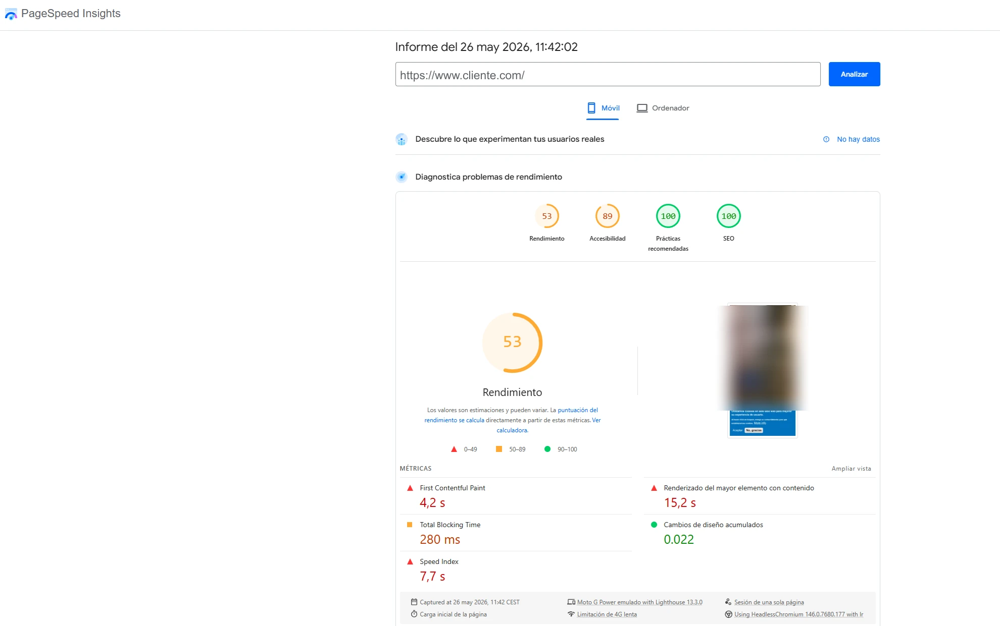
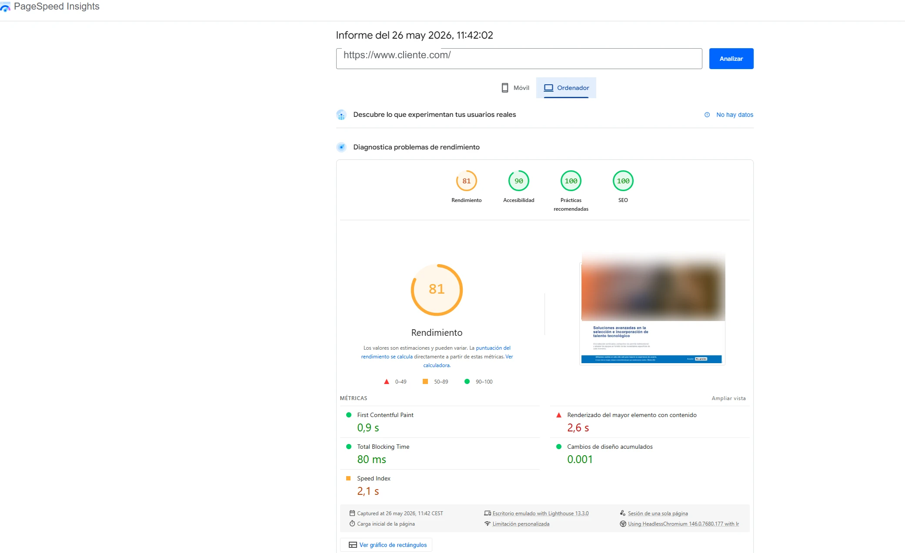
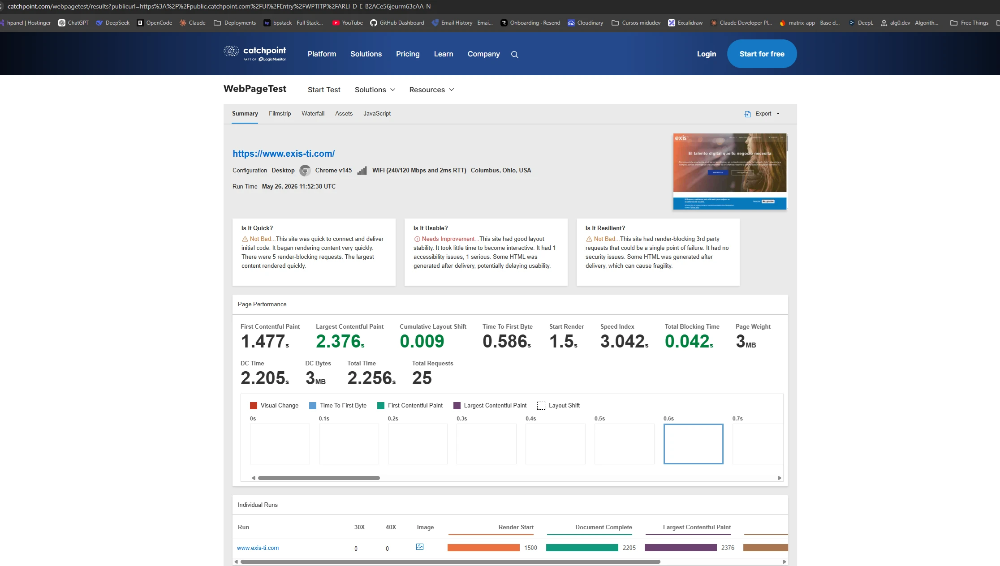
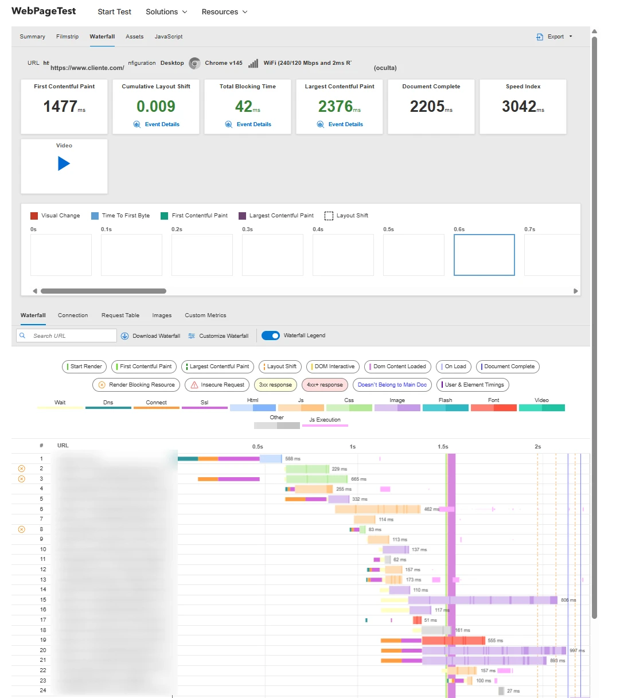
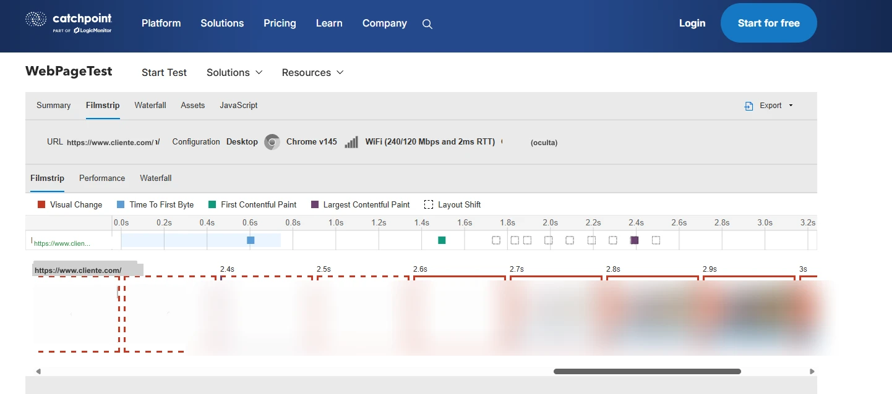
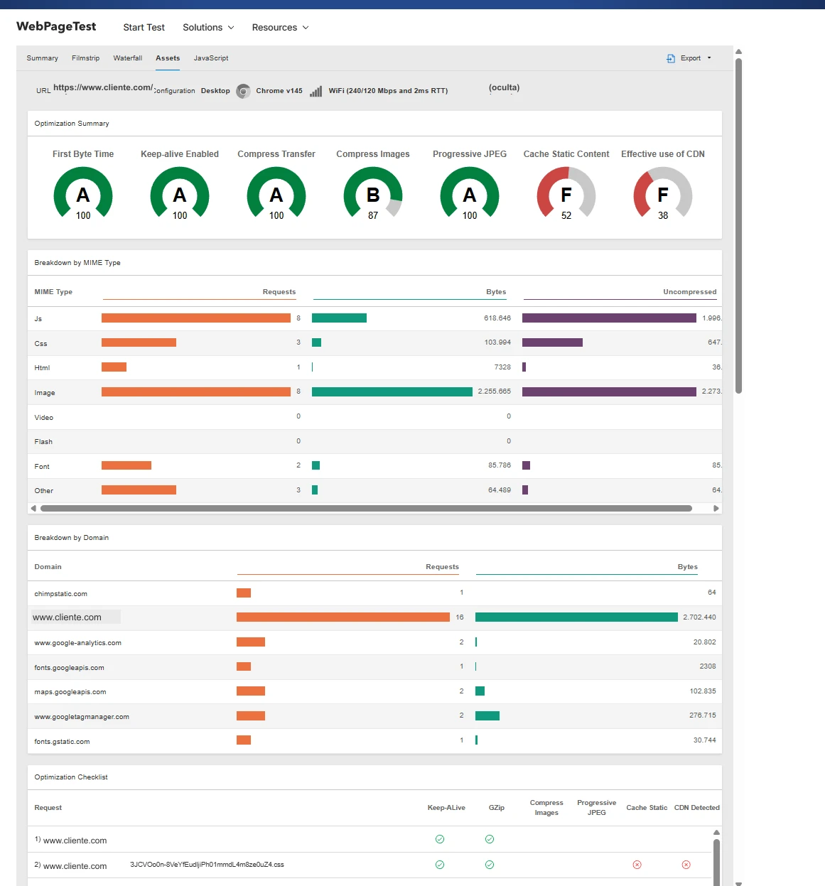
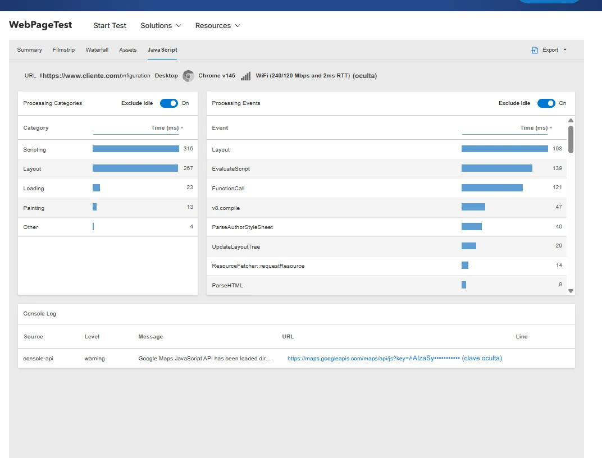
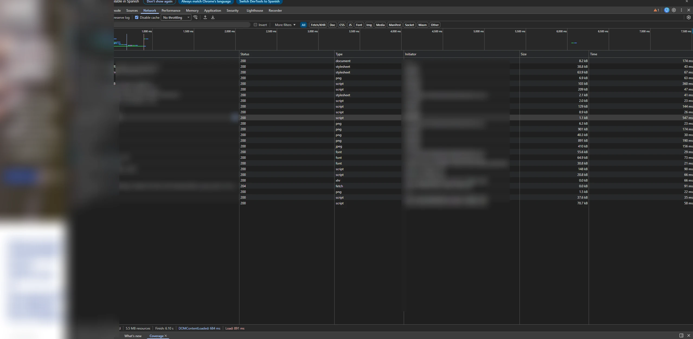
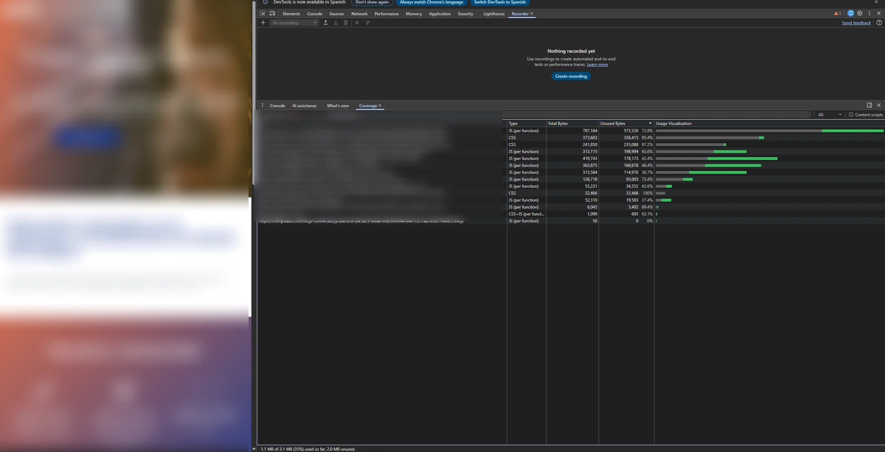

# Análisis de Rendimiento — cliente.com

> **Fecha del análisis:** 26 de mayo de 2026  
> **Herramienta:** Google PageSpeed Insights (Lighthouse 13.3.0)  
> **URL:** https://www.cliente.com/  
> **Fuente de datos:** Sin datos de campo CrUX — análisis basado únicamente en métricas de
> laboratorio

---

## 1. Resumen de Puntuaciones

| Categoría                  | Desktop | Mobile |
| -------------------------- | ------- | ------ |
| **Rendimiento**            | 🔴 41   | 🟠 53  |
| **Accesibilidad**          | 🟢 100  | 🟠 89  |
| **Prácticas recomendadas** | 🟢 100  | 🟢 100 |
| **SEO**                    | 🟢 100  | 🟢 100 |

> Escala: 🔴 0–49 (malo) · 🟠 50–89 (necesita mejora) · 🟢 90–100 (bueno)

El rendimiento tanto en desktop como en móvil es **deficiente**. El score de desktop (41) es
especialmente llamativo para lo que debería ser una web corporativa con tráfico mayoritariamente
profesional.





---

## 2. Métricas Core Web Vitals

### Desktop

| Métrica                            | Valor | Umbral bueno | Valoración   |
| ---------------------------------- | ----- | ------------ | ------------ |
| **FCP** (First Contentful Paint)   | 0.9 s | < 1.8 s      | 🟢 Bueno     |
| **LCP** (Largest Contentful Paint) | 2.6 s | < 2.5 s      | 🟠 Mejorable |
| **TBT** (Total Blocking Time)      | 80 ms | < 200 ms     | 🟢 Bueno     |
| **CLS** (Cumulative Layout Shift)  | 0.001 | < 0.1        | 🟢 Bueno     |
| **Speed Index**                    | 2.1 s | < 3.4 s      | 🟢 Bueno     |

### Mobile (Moto G Power · 4G limitado · Lighthouse 13.3.0)

| Métrica                            | Valor      | Umbral bueno | Valoración   |
| ---------------------------------- | ---------- | ------------ | ------------ |
| **FCP** (First Contentful Paint)   | 4.2 s      | < 1.8 s      | 🔴 Muy malo  |
| **LCP** (Largest Contentful Paint) | **15.2 s** | < 2.5 s      | 🔴 Crítico   |
| **TBT** (Total Blocking Time)      | 280 ms     | < 200 ms     | 🟠 Mejorable |
| **CLS** (Cumulative Layout Shift)  | 0.022      | < 0.1        | 🟢 Bueno     |
| **Speed Index**                    | 7.7 s      | < 3.4 s      | 🔴 Muy malo  |











> **El LCP móvil de 15.2 segundos es el dato más crítico de este análisis.** Un usuario en móvil
> espera más de 15 segundos para ver el elemento más importante de la página. Google considera
> cualquier LCP superior a 4 s como "malo" y penaliza el ranking en búsquedas móviles (Core Web
> Vitals afectan al ranking desde 2021).

---

## 3. Análisis de Causas

### 3.1 LCP catastrófico en móvil (15.2 s)

El LCP suele corresponder a la imagen hero o al bloque de texto más grande visible sin scroll. Las
causas probables en este stack:

- **Imagen de fondo via CSS** (`background-image` en sección parallax): el navegador no puede
  precargar imágenes declaradas en CSS con la misma prioridad que un ``. En móvil, la imagen
  hero se referencia como `data-background` y se aplica por JS — esto retrasa el descubrimiento.
- **Carga de JS bloqueante** antes del render: Drupal agrega todo el JavaScript en el `<head>` o con
  patrones que bloquean el parser.
- **Google Fonts con `@import` dentro del CSS:** bloquea el render hasta que el CSS principal
  termina de parsear y entonces lanza la petición a Google, que a su vez bloquea el render de texto.
- **Throttling 4G**: en condiciones de red limitada, la suma de peticiones no optimizadas se
  amplifica.

### 3.2 Score de desktop bajo (41) a pesar de buenas métricas individuales

Paradoja habitual en Lighthouse: las métricas Core Web Vitals pueden ser aceptables en desktop, pero
el score global baja por auditorías de oportunidad:

- **JavaScript no utilizado**: el tema Rhythm carga librerías globales (YTP, OWL Carousel, countTo,
  WOW) en todas las páginas aunque no se usen.
- **CSS no utilizado**: Bootstrap 3 completo se carga aunque solo se use un subconjunto de clases.
- **Imágenes sin formatos modernos**: probablemente sirven JPEG/PNG en lugar de WebP/AVIF.
- **Imágenes sin dimensiones declaradas**: produce reflow y puede afectar CLS.
- **Sin lazy loading** en imágenes fuera del viewport inicial.
- **Render-blocking resources**: CSS y JS en el `<head>` sin `async`/`defer` apropiado.

---

## 4. Recursos que Bloquean el Render

Basado en el análisis del HTML fuente, el orden de carga es:

```html
<!-- 1. CSS agregado de Drupal (bloquea render) -->
<link rel="stylesheet" href="...css_4fyI4F3JC....css" />
<link rel="stylesheet" href="...css_rNuFv....css" />
<!-- ↑ Este segundo CSS contiene @import de Google Fonts — doble bloqueo -->

<!-- 2. JS para IE8 condicional (irrelevante pero presente) -->
<!--[if lte IE 8]><script src="...js_VtafjX....js"></script><![endif]-->

<!-- 3. Google Analytics (async — correcto) -->
<script async src="https://www.googletagmanager.com/gtag/js?id=UA-..."></script>

<!-- 4. Mailchimp (bloqueante — sin async/defer) -->
<script id="mcjs">
  !function(c,h,i,m,p){...}(document,"script","https://chimpstatic.com/...")
</script>

<!-- BODY -->
<!-- 5. Google Maps API (bloqueante — sin async/defer apropiado) -->
<script src="//maps.googleapis.com/maps/api/js?key=..." type="text/javascript"></script>

<!-- 6. JS principal de Drupal (bloqueante) -->
<script src="...js_6N_r4vi....js"></script>

<!-- 7. EU Cookie Compliance (defer — correcto) -->
<script src=".../eu_cookie_compliance.js?v=1.9" defer></script>
```

**Problemas identificados:**

- El script de Mailchimp se inyecta de forma inline sin `async`, bloqueando el parser.
- Google Maps se carga sin `loading=async` en el callback.
- CSS de Google Fonts via `@import` dentro de un stylesheet — el peor patrón posible para fonts.
- Sin `<link rel="preconnect">` para Google Fonts ni para Google Maps.

---

## 5. Análisis de Imágenes

Rutas detectadas en el HTML:

| Imagen                      | Formato | Observación                                     |
| --------------------------- | ------- | ----------------------------------------------- |
| `cliente-26.jpg`            | JPEG    | Sin formato moderno (WebP/AVIF)                 |
| `cliente-home-03.png`       | PNG     | Imagen de fondo via `data-background` (JS lazy) |
| `cliente-background-06.png` | PNG     | Ídem — no precargable por el navegador          |
| `cliente-FAV_0.png`         | PNG     | Favicon — formato correcto                      |
| `logotipo.png`              | PNG     | Logotipo — debería ser SVG o WebP               |

**Problemas:**

- Uso de PNG para fondos que deberían ser WebP/AVIF (hasta 50-80% menos peso).
- Imágenes de fondo referenciadas como `data-background` y aplicadas por JS: el navegador no puede
  precargarlas con `<link rel="preload">`, lo que retrasa enormemente el LCP.
- Logotipo servido como PNG en lugar de SVG.

---

## 6. Impacto en SEO y Negocio

Desde mayo 2021, Google utiliza **Core Web Vitals como factor de ranking**. Con estos valores:

| CWV             | Mobile | Umbral "bueno" | Penalización SEO |
| --------------- | ------ | -------------- | ---------------- |
| LCP             | 15.2 s | < 2.5 s        | Sí — muy severa  |
| FCP             | 4.2 s  | < 1.8 s        | Sí               |
| TBT (proxy FID) | 280 ms | < 200 ms       | Leve             |
| CLS             | 0.022  | < 0.1          | No               |

Una web de reclutamiento tecnológico con estos valores está perdiendo posicionamiento frente a
competidores con mejores Core Web Vitals, especialmente en búsquedas móviles.

---

## 7. Recomendaciones de Mejora

### Inmediatas (sin cambiar de plataforma)

| Mejora                                                      | Impacto en LCP | Dificultad |
| ----------------------------------------------------------- | -------------- | ---------- |
| Convertir imágenes a WebP/AVIF                              | Alto           | Baja       |
| Añadir `loading="lazy"` a imágenes out-of-fold              | Medio          | Baja       |
| Reemplazar `@import` de fonts por `<link>` con `preconnect` | Alto           | Baja       |
| Añadir `fetchpriority="high"` a imagen LCP                  | Alto           | Baja       |
| Usar imagen `` para hero en lugar de `data-background` | Alto           | Media      |
| Añadir `async` al script de Mailchimp                       | Medio          | Baja       |
| Eliminar librerías JS no usadas por página                  | Medio          | Media      |

### Estructurales (requieren migración)

| Mejora                                  | Impacto total | Complejidad |
| --------------------------------------- | ------------- | ----------- |
| Migrar a Astro (SSG/SSR)                | Muy alto      | Alta        |
| Eliminar Bootstrap 3 → Tailwind CSS     | Alto          | Alta        |
| Eliminar jQuery completamente           | Medio         | Media       |
| Servir fuentes desde el propio servidor | Medio         | Baja        |
| Implementar CDN (Cloudflare)            | Alto          | Baja        |
| Optimizar imágenes en pipeline de build | Alto          | Media       |

---

## 8. Comparativa de Referencia

Para contextualizar estos resultados, una landing corporativa bien construida en Astro debería
alcanzar:

| Métrica     | Cliente actual (mobile) | Objetivo recomendable |
| ----------- | ----------------------- | --------------------- |
| LCP         | 15.2 s                  | < 1.5 s               |
| FCP         | 4.2 s                   | < 1.0 s               |
| TBT         | 280 ms                  | < 50 ms               |
| Speed Index | 7.7 s                   | < 2.0 s               |
| Performance | 53                      | > 95                  |

---

## 9. Análisis de Red (Chrome DevTools Network)

> **Fuente:** Chrome DevTools → pestaña Network · Disable cache activado · carga completa de
> `https://www.cliente.com/` · Capturado el 26 de mayo de 2026
> **Archivo:** `screenshots/devtools-network.webp`

### Resumen de la carga

| Métrica | Valor | Interpretación |
| --- | --- | --- |
| **Requests** | 26 | 26 peticiones HTTP para cargar una sola página corporativa |
| **Transferido** | 3.3 MB | Datos reales descargados por el navegador (comprimidos) |
| **Recursos (sin comprimir)** | 5.5 MB | Tamaño real en memoria una vez descomprimidos |
| **Finish** | 6.10 s | Tiempo hasta que el último recurso termina de cargar |
| **DOMContentLoaded** | 684 ms | El HTML parseado — relativamente rápido |
| **Load** | 891 ms | Evento load del navegador — parece bajo, pero el JS sigue ejecutándose después |

### Análisis

**El DOMContentLoaded (684 ms) y Load (891 ms) pueden parecer engañosamente buenos.** Estos
eventos se disparan cuando el HTML y los recursos iniciales están listos, pero no miden cuándo
la página es visualmente completa ni interactiva. El LCP de 15.2 s ocurre después de estos
eventos, mientras el JS sigue ejecutándose y cargando imágenes diferidas.

**3.3 MB transferidos para una web corporativa de 6 páginas es excesivo.** Un sitio equivalente
en Astro transferiría entre 200–400 KB en la primera carga — una reducción del 88–94%.

**El gap entre transferido (3.3 MB) y recursos (5.5 MB)** indica que los assets están
comprimidos con gzip en el servidor (ratio ~1.7:1), pero el problema de peso no es la falta
de compresión — es la cantidad de código innecesario que se carga (ver sección 9, Coverage).

**26 peticiones** para una página estática corporativa es un número alto. Incluye:
- 2 bundles CSS de Drupal
- 1 bundle JS principal + 1 bundle secundario
- Google Fonts (2 peticiones: CSS + fuentes)
- Google Maps API (3 peticiones encadenadas)
- Google Analytics UA + GA4 (2 peticiones — ambos activos)
- Mailchimp
- EU Cookie Compliance
- Imágenes de fondo y contenido

Un sitio en Astro con Tailwind y Fontsource generaría entre **6–10 peticiones** en la primera
carga, todas en paralelo y sin bloqueantes.



---

## 10. Análisis de Cobertura CSS/JS (Chrome DevTools Coverage)

> **Fuente:** Exportación directa del panel Coverage de Chrome DevTools durante la carga completa de
> `https://www.cliente.com/` · Capturado el 26 de mayo de 2026 **Archivo:**
> `screenshots/Coverage-20260526T142048.json`

### Resumen global

| Métrica                              | Valor        |
| ------------------------------------ | ------------ |
| **Total descargado**                 | 3.050 KB     |
| **Código realmente utilizado**       | 1.050 KB     |
| **Código descargado y no utilizado** | **1.999 KB** |
| **Porcentaje desperdiciado**         | **65.6%**    |

De cada 3 KB que el servidor envía al navegador, **2 KB nunca se ejecutan ni se aplican**.

### Desglose por archivo

| Archivo                                 | Total  | Sin usar | % sin usar | Diagnóstico                                                                   |
| --------------------------------------- | ------ | -------- | ---------- | ----------------------------------------------------------------------------- |
| `css_rNuFv….css` (CSS bundle 1)         | 365 KB | 348 KB   | **95.4%**  | Bootstrap 3 completo + tema Rhythm. Solo se usa ~17 KB                        |
| `css_4fyI4….css` (CSS bundle 2)         | 236 KB | 230 KB   | **97.2%**  | Segundo bundle CSS agregado por Drupal. Casi todo sin usar                    |
| `js_6N_r4….js` (JS bundle principal)    | 769 KB | 560 KB   | **72.8%**  | jQuery + Bootstrap JS + OWL Carousel + WOW.js + countTo + YTP + appear        |
| `maps/api/js` (Google Maps)             | 306 KB | 194 KB   | **63.6%**  | API completa de Maps cargada aunque solo hay un mapa estático                 |
| `gtag/js?id=UA-…` (Universal Analytics) | 355 KB | 165 KB   | **46.4%**  | UA deprecado desde jul. 2023 — 355 KB descargados en cada visita sin recoger ningún dato. No fue eliminado al añadir GA4 |
| `gtag/js?id=G-XXXXXXXXXX` (GA4)         | 410 KB | 174 KB   | **42.4%**  | GA4 activo — pero coexiste con el UA sin limpiar. 765 KB totales de analytics por lo que debería ser ~400 KB |
| `maps-api/common.js`                    | 124 KB | 91 KB    | **73.4%**  | Librería interna de Maps                                                      |
| `fonts.googleapis.com/css`              | 32 KB  | 32 KB    | **100%**   | CSS de Google Fonts descargado entero, 0 bytes aplicados                      |
| `eu_cookie_compliance.js`               | 54 KB  | 34 KB    | **62.6%**  | Módulo de cookies — carga código para escenarios que no se dan en esta página |

### Hallazgo adicional — GA4 confirmado

El análisis de cobertura revela la presencia de `gtag/js?id=G-XXXXXXXXXX` — **el cliente tiene GA4
instalado y activo**. Este dato no era visible en el análisis del HTML fuente de la página
`/es/empresas`. Contradice la hipótesis de pérdida total de datos desde julio 2023 y requiere
verificación directa en Google Analytics para confirmar qué propiedad recoge datos y desde cuándo.

> **Acción:** Verificar en `analytics.google.com` si la propiedad `G-XXXXXXXXXX` tiene datos
> históricos y desde qué fecha está activa.



### Por qué el CSS tiene 95–97% sin usar

Bootstrap 3 se distribuye como un único archivo CSS con estilos para más de 200 componentes (tablas,
modales, formularios, carruseles, paginación, badges, alertas...). La página de Empresas usa
aproximadamente 15 de esos componentes. El 85% restante del framework se descarga, parsea y descarta
en cada carga.

En Astro con Tailwind, el CSS generado en build contiene **únicamente** las clases que aparecen en
el HTML final. Un sitio de este tamaño termina con 8–15 KB de CSS total frente a los 601 KB actuales
(un 97.5% de reducción).
