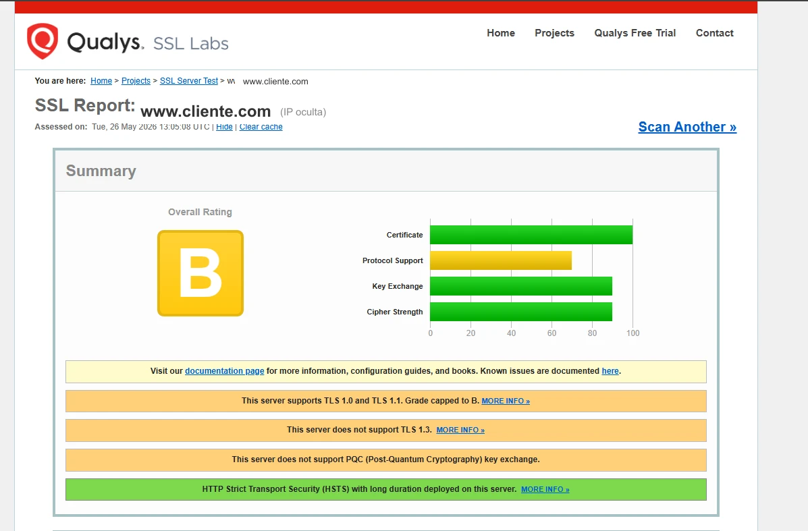
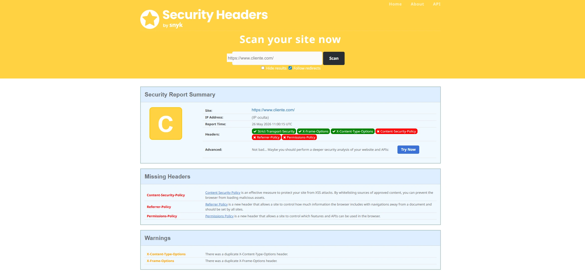

# Análisis de Seguridad — cliente.com

> **Fecha del análisis:** 26 de mayo de 2026  
> **Metodología:** Análisis de cabeceras HTTP, HTML fuente, fingerprinting de versiones, consulta de
> CVEs públicos

---

## 1. Resumen Ejecutivo de Riesgos

| Hallazgo                                | Severidad  | Estado                           |
| --------------------------------------- | ---------- | -------------------------------- |
| Drupal 8 EOL (sin parches de seguridad) | 🔴 Crítico | Sin resolver                     |
| Apache 2.4.10 (versión de 2014)         | 🔴 Crítico | Sin resolver                     |
| TLS 1.0 y 1.1 activos — protocolos obsoletos | 🟠 Alto | Sin resolver — SSL Labs Grade B  |
| jQuery 3.4.1 — CVE-2020-11022 y 11023   | 🟠 Alto    | Sin resolver                     |
| Content-Security-Policy ausente         | 🟠 Alto    | Sin resolver                     |
| TLS 1.3 no soportado                    | 🟡 Medio   | Sin resolver                     |
| Google Maps API Key expuesta            | 🟡 Medio   | Revisable                        |
| `/core/CHANGELOG.txt` accesible         | 🟡 Bajo    | Fácil de bloquear                |
| `X-Generator` header expuesto           | 🟡 Bajo    | Fácil de eliminar                |
| Universal Analytics deprecado           | ⚪ Info    | Sin impacto de seguridad directo |

---

## 2. SSL/TLS — Qualys SSL Labs (Grade B)

**Resultado:** `ssllabs-result.png` — Analizado el 26 de mayo de 2026.

| Categoría          | Puntuación | Valoración                              |
| ------------------ | ---------- | --------------------------------------- |
| **Overall Rating** | **B**      | Penalizado por TLS 1.0/1.1              |
| Certificate        | ~100       | Certificado válido y bien configurado   |
| Protocol Support   | ~65        | TLS 1.0/1.1 activos — bajan el score   |
| Key Exchange       | ~85        | Correcto                                |
| Cipher Strength    | ~90        | Correcto                                |

### Hallazgos detallados

**TLS 1.0 y TLS 1.1 activos — grade capped to B**

El servidor acepta conexiones con TLS 1.0 (2000) y TLS 1.1 (2006). Ambos protocolos están
considerados obsoletos e inseguros desde 2020 (RFC 8996). Su presencia es lo que impide obtener
una nota A. Son susceptibles a ataques como POODLE y BEAST.

**TLS 1.3 no soportado**

El protocolo más moderno (2018) no está habilitado. TLS 1.3 es más rápido (0-RTT handshake) y
elimina cipher suites débiles. Con Apache 2.4.10 de 2014 es imposible soportarlo — requiere
versión 2.4.36+ y OpenSSL 1.1.1+.

**Sin PQC (Post-Quantum Cryptography) key exchange**

No soporta los nuevos algoritmos post-cuánticos. Es un aviso informativo de SSL Labs — no afecta
a la nota hoy, pero será relevante en los próximos años.

**HSTS correcto** ✅

`Strict-Transport-Security` con duración larga está correctamente desplegado, confirmado por SSL
Labs con una notificación en verde.

### Solución

Todos estos problemas se resuelven con la actualización de Apache (o migración al nuevo servidor
Astro + hosting moderno). Un servidor con Apache 2.4.6x + OpenSSL 1.1.1+ soportaría TLS 1.3,
desactivaría TLS 1.0/1.1 y obtendría grade **A+**.



---

## 3. Cabeceras de Seguridad HTTP (SecurityHeaders.com — Grade C)

### Cabeceras presentes

| Cabecera                    | Valor                                          | Valoración                         |
| --------------------------- | ---------------------------------------------- | ---------------------------------- |
| `Strict-Transport-Security` | `max-age=15768000; includeSubdomains; preload` | ✅ Correcto                        |
| `X-Frame-Options`           | `SAMEORIGIN`                                   | ✅ Correcto                        |
| `X-Content-Type-Options`    | `nosniff`                                      | ✅ Correcto                        |
| `X-UA-Compatible`           | `IE=edge`                                      | ⚠️ Obsoleto (IE muerto desde 2022) |

### Cabeceras ausentes — riesgo

| Cabecera                           | Función                                                     | Riesgo si ausente           |
| ---------------------------------- | ----------------------------------------------------------- | --------------------------- |
| **`Content-Security-Policy`**      | Define fuentes de contenido permitidas                      | XSS, inyección de scripts   |
| **`Permissions-Policy`**           | Controla acceso a APIs del navegador (cámara, micrófono...) | Abuso de APIs del navegador |
| **`Referrer-Policy`**              | Controla qué información se envía en la cabecera Referer    | Filtración de URLs internas |
| **`Cross-Origin-Opener-Policy`**   | Aísla el contexto de navegación entre ventanas              | Ataques Spectre/XS-Leaks    |
| **`Cross-Origin-Resource-Policy`** | Controla qué orígenes pueden cargar los recursos            | Ataques de timing           |



> **Cabeceras duplicadas detectadas:** Los raw headers muestran que `X-Content-Type-Options` y
> `X-Frame-Options` aparecen **dos veces cada una**. Se están añadiendo tanto desde Apache como
> desde Drupal simultáneamente. No es un riesgo de seguridad, pero indica configuración
> desorganizada — si en el futuro se cambia el valor en un solo sitio, el otro seguirá enviando
> el valor antiguo.

**La ausencia de CSP es el hallazgo más relevante.** En una web que:

- Carga scripts de terceros (Google Analytics, Mailchimp, Google Maps)
- Usa Drupal 8 (EOL, sin parches)
- Ejecuta jQuery 3.4.1 (con CVEs XSS conocidos)

...la falta de CSP significa que cualquier XSS exitoso puede inyectar y ejecutar scripts arbitrarios
sin restricción.

---

## 3. jQuery 3.4.1 — Vulnerabilidades Conocidas

### CVE-2020-11022 (CVSS: 6.1 — Medio-Alto)

- **Afecta:** jQuery < 3.5.0
- **Tipo:** Cross-Site Scripting (XSS)
- **Descripción:** El método `jQuery.htmlPrefilter()` procesa HTML que pasa por `html()`,
  `append()`, `after()`, etc. sin sanitizar correctamente. Un atacante que controle HTML que se pase
  a estos métodos puede inyectar y ejecutar JavaScript arbitrario.
- **Estado en cliente.com:** VULNERABLE — usan 3.4.1

### CVE-2020-11023 (CVSS: 6.1 — Medio-Alto)

- **Afecta:** jQuery < 3.5.0
- **Tipo:** Cross-Site Scripting (XSS)
- **Descripción:** Complementaria a CVE-2020-11022. Afecta específicamente a manipulación de HTML
  con etiquetas `<option>` en contextos específicos del DOM.
- **Estado en cliente.com:** VULNERABLE — usan 3.4.1

### Contexto y explotabilidad real

Estas vulnerabilidades son del tipo **"second-order XSS"**: requieren que el atacante logre que
jQuery procese HTML controlado por él. En la práctica:

- Si Drupal 8 tiene alguna vulnerabilidad que permita inyectar contenido en la base de datos (y hay
  muchas conocidas desde su EOL), el jQuery desactualizado amplifica el impacto.
- En un CMS con un backend de administración, el vector más probable es un usuario administrador que
  visite una URL maliciosa o que se haya inyectado contenido en el CMS.

**Solución:** Actualizar jQuery a ≥ 3.5.0 (actualmente 3.7.x es la versión estable).

---

## 4. Google Maps API Key expuesta — ¿Es un problema grave?

### La clave detectada

```
<API_KEY_REDACTADA>
```

Visible en el HTML fuente de cualquier página que tenga el mapa incrustado:

```html
<script
  src="//maps.googleapis.com/maps/api/js?key=<API_KEY_REDACTADA>"
  type="text/javascript"
></script>
```

### ¿Es intencional o un error?

**Es técnicamente inevitable que la clave de Google Maps JS API esté en el HTML.** La API requiere
que el key se incluya en la llamada al script en el cliente — no hay forma de ocultarlo. Cualquier
web que use Google Maps JS API tiene su clave expuesta de esta manera. Esto es por diseño de Google.

### ¿Cuándo es un problema?

El riesgo real no es que la clave sea visible, sino que **no esté restringida correctamente** en
Google Cloud Console. Google permite dos tipos de restricciones:

| Tipo de restricción           | Cómo funciona                                                   |
| ----------------------------- | --------------------------------------------------------------- |
| **Restricción de aplicación** | Limita el uso a dominios HTTP específicos (`*.cliente.com`)     |
| **Restricción de API**        | Limita qué APIs de Google puede usar esa key (solo Maps JS API) |

**Si la clave NO tiene restricción de dominio configurada:**

- Cualquier persona que copie la clave puede usarla desde su propio dominio/servidor.
- Google factura al propietario de la clave por esas peticiones.
- Un abuso masivo (web scraping, generación de maps en bots) puede generar una factura de miles de
  euros sin aviso inmediato.
- Google tiene sistemas de detección de anomalías y puede bloquear la key, dejando el mapa de la web
  inoperativo.

**Si la clave SÍ tiene restricción de dominio (lo más probable en una web profesional):**

- Solo funciona desde `*.cliente.com` — cualquier petición desde otro dominio es rechazada.
- El riesgo es prácticamente nulo.
- La key expuesta no aporta valor a un atacante.

### Veredicto

El hecho de que la clave sea pública **no indica negligencia por sí mismo** — es la única forma de
usar Google Maps JS API. Sin embargo, **sí debemos verificar que la clave esté restringida al
dominio**. Un auditor de seguridad responsable lo verificaría intentando usar la key desde otro
origen (sin hacer peticiones reales) o confirmándolo con el administrador del sitio.

**Recomendación al cliente:**

1. Acceder a [Google Cloud Console](https://console.cloud.google.com/) → API y servicios →
   Credenciales.
2. Verificar que la key `<API_KEY_REDACTADA>` tiene "Restricciones de HTTP referrers" configuradas para
   `*.cliente.com/*`.
3. Verificar que solo tiene habilitada la "Maps JavaScript API" y ninguna API adicional.
4. Activar alertas de facturación para detectar usos anómalos.

---

## 5. Drupal 8 EOL — Implicaciones de Seguridad

Drupal 8 alcanzó su **End of Life el 2 de noviembre de 2021**. Desde esa fecha:

- El equipo de seguridad de Drupal **no publica parches** para vulnerabilidades descubiertas en D8.
- Los módulos contrib también han dejado de publicar versiones compatibles con D8.
- La base de datos de vulnerabilidades pública (Drupal Security Advisories) ya no cubre D8.

### Vulnerabilidades conocidas post-EOL relevantes

La comunidad de seguridad ha continuado identificando vulnerabilidades en código que existe en D8 (y
algunas comparten código con D9/D10 pero se parchean solo en las versiones soportadas):

- **SA-CORE-2022-xxx**: varias advisories publicadas después del EOL de D8 que afectan código
  presente en D8 pero que no se parchea en esa rama.
- El módulo `we_megamenu` y `nikadevs_cms` son módulos sin mantenimiento activo — potenciales
  vectores de ataque adicionales.

### Fingerprinting facilitado

El servidor anuncia explícitamente que usa Drupal 8:

```
X-Generator: Drupal 8 (https://www.drupal.org)
```

Y el archivo `/core/CHANGELOG.txt` es accesible públicamente, lo que permite a un atacante confirmar
la versión exacta del core sin necesidad de escaneo activo.

---

## 6. Apache 2.4.10 — Servidor Obsoleto

La versión `Apache 2.4.10` fue lanzada en **julio de 2014** — hace más de 11 años. La rama 2.4.x ha
tenido decenas de CVEs desde entonces, incluyendo:

- Múltiples vulnerabilidades de path traversal
- Vulnerabilidades de DoS
- Problemas con mod_ssl y TLS
- Vulnerabilidades en mod_proxy

La versión actual estable de Apache es **2.4.62** (julio 2024). Un servidor con 11 años de atraso en
actualizaciones supone un riesgo de seguridad sistémico para toda la infraestructura.

---

## 7. Fingerprinting y Exposición de Información

El servidor expone más información de la necesaria sobre su stack:

| Vector de exposición               | Información revelada                       | Mitigación                        |
| ---------------------------------- | ------------------------------------------ | --------------------------------- |
| Cabecera `Server`                  | `Apache/2.4.10 (Debian)`                   | `ServerTokens Prod` en Apache     |
| Cabecera `X-Generator`             | `Drupal 8 (https://www.drupal.org)`        | Eliminar en `settings.php`        |
| Meta `Generator` en HTML           | `Drupal 8 (https://www.drupal.org)`        | Eliminar en hook_page_attachments |
| `/core/CHANGELOG.txt` accesible    | Confirma versión de Drupal                 | Bloquear en `.htaccess`           |
| `/robots.txt` con plantilla Drupal | Revela estructura de Drupal                | Personalizar                      |
| Comentarios Twig en HTML           | Rutas de plantillas, estructura de módulos | Desactivar theme debug            |

> **Nota crítica:** El HTML de producción contiene comentarios de debug de Twig
> (`<!-- THEME DEBUG -->` `<!-- FILE NAME SUGGESTIONS: -->`). El servidor **está corriendo en
> modo de desarrollo/debug**, lo que expone información de la estructura interna de Drupal y
> reduce el rendimiento significativamente.

---

## 8. Recomendaciones por Prioridad

### Prioridad 1 — Inmediata

1. **Verificar restricciones de Google Maps API key** en Google Cloud Console.
2. **Desactivar Twig debug** en producción (`twig.config: debug: false` en `services.yml`).
3. **Bloquear acceso a `CHANGELOG.txt`** en `.htaccess`:
   ```apache
   <Files CHANGELOG.txt>
     Order allow,deny
     Deny from all
   </Files>
   ```
4. **Eliminar cabeceras `X-Generator` y `Server`** detalladas.

### Prioridad 2 — Corto plazo

5. **Actualizar jQuery** a ≥ 3.5.0 para mitigar CVE-2020-11022 y CVE-2020-11023.
6. **Implementar Content-Security-Policy** (al menos en modo report-only para empezar).
7. **Añadir `Referrer-Policy`** y **`Permissions-Policy`**.
8. **Actualizar Apache** a la versión 2.4.x actual.

### Prioridad 3 — Medio plazo

9. **Migrar de Drupal 8** a una plataforma soportada (Drupal 10 o Astro).
10. **Verificar y actualizar todos los módulos contrib** (we_megamenu, eu_cookie_compliance).
11. **Implementar WAF** (Web Application Firewall) — Cloudflare Free ya ofrece protección básica.
12. **Eliminar el script de Universal Analytics** (`UA-XXXXXXXXX-1`) — GA4 ya está activo vía GTM (`G-XXXXXXXXXX`). UA no procesa datos desde julio de 2023 y añade 355 KB de peso muerto por carga.
