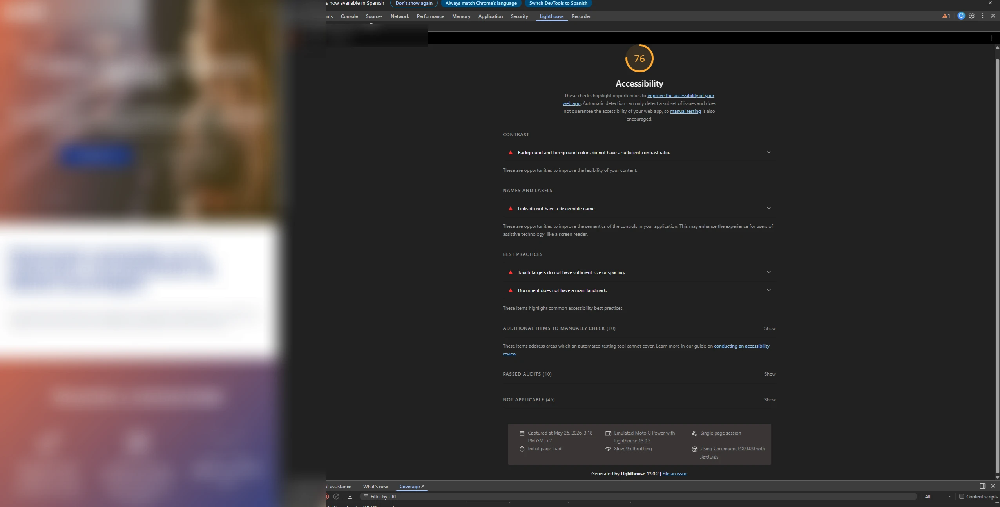
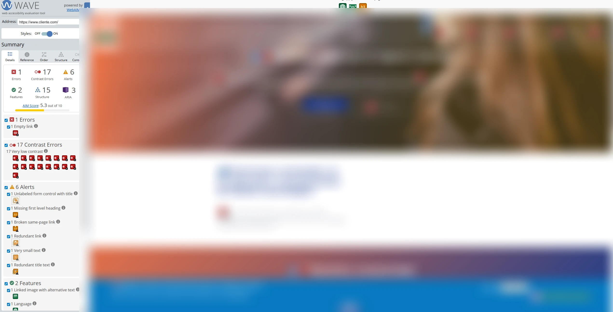

# Análisis de Accesibilidad — cliente.com

> **Fecha del análisis:** 26 de mayo de 2026
> **Herramienta principal:** Google Lighthouse 13.3.0 (PageSpeed Insights)
> **URL analizada:** https://www.cliente.com/es/empresas
> **Fuente secundaria:** Inspección del HTML fuente

---

## 1. Resumen de Puntuaciones

| Herramienta            | URL analizada              | Score / Resultado                   |
| ---------------------- | -------------------------- | ----------------------------------- |
| **PageSpeed (mobile)** | `/es/empresas`             | 🟠 89 — 11 puntos de penalización   |
| **PageSpeed (desktop)**| `/es/empresas`             | 🟢 100 — sin problemas              |
| **Lighthouse DevTools**| `/` (home)                 | 🟠 76 — score inferior a PageSpeed  |
| **WAVE**               | `/` (home)                 | 1 error · **17 contrast errors** · 6 alerts |

> **Nota:** PageSpeed Insights y Lighthouse DevTools pueden dar resultados distintos para URLs
> diferentes. El score 89 corresponde a `/es/empresas` (página interior con más contenido
> estructurado); el 76 corresponde a la home, que tiene más elementos visuales complejos.
> Los 17 errores de contraste de WAVE son el hallazgo más relevante que complementa el análisis.



---

## 2. WAVE — Resultados detallados (home)



**Resultado:** Analizado el 26 de mayo de 2026.

| Categoría           | Cantidad | Descripción                                     |
| ------------------- | -------- | ----------------------------------------------- |
| **Errors**          | 1        | Error ARIA (elemento con referencia rota)        |
| **Contrast Errors** | **17**   | Texto con contraste insuficiente respecto al fondo |
| **Alerts**          | 6        | Posibles problemas (enlaces redundantes, heading ausente, etc.) |
| Features            | 2        | Elementos de accesibilidad positivos             |
| Structural          | 15       | Elementos estructurales detectados               |
| ARIA                | 3        | Usos de ARIA detectados                          |

### Los 17 errores de contraste

Este dato contradice el análisis inicial basado solo en los colores corporativos principales.
El azul `#1b3991` con texto blanco sí pasa WCAG AA, pero WAVE detecta **17 combinaciones** en la
página que no lo hacen — probablemente en:

- Texto gris sobre fondo blanco en secciones de cuerpo
- Texto sobre las imágenes de fondo (parallax / hero) donde el contraste varía según la imagen
- Texto en el banner de cookies (`#0779bf` como fondo con texto que puede quedar por debajo)
- Elementos del footer con opacidad reducida

**Acción recomendada:** Revisar en WAVE cada uno de los 17 elementos marcados en rojo para
identificar exactamente qué combinaciones fallan y con qué ratio real.

---

## 3. Causa de la Brecha Desktop/Mobile (−11 puntos)

Los auditores de Lighthouse que penalizan en móvil pero no en desktop son principalmente:

### 3.1 Tamaño de targets táctiles insuficiente

En móvil, los elementos interactivos deben tener un área mínima de **48×48 px** (recomendación
WCAG 2.5.5 y criterio de Lighthouse). Los problemas identificados:

- **Enlace de LinkedIn en el footer:** el icono `<i class="fa fa-linkedin">` es el único elemento
  clicable y no tiene área suficiente — es un icono de fuente sin padding táctil.
- **Ítem del selector de idioma:** el texto "es" con `<i class="fa fa-angle-down">` como único
  affordance tiene área táctil reducida.
- **Enlace del logo:** `<a href="..." class="logo">` contiene solo la imagen del logotipo, cuyo
  tamaño en móvil puede quedar por debajo del umbral táctil.
- **Botón de menú móvil:** `<a id="menu-toggle" class="navbar-toggle collapsed">` sin dimensiones
  mínimas garantizadas.

### 3.2 Texto con tamaño de fuente demasiado pequeño

El footer contiene texto a **11px** con estilo inline:

```html
<p style="color:white !important; font-size: 11px; margin-bottom: 0px;">
  <a href="...">CONTACTO</a> &nbsp; <a href="...">AVISO LEGAL</a> ...
</p>
```

11px está por debajo del mínimo recomendado (16px cuerpo, 12px mínimo absoluto). En móvil, donde
los usuarios tienen el dispositivo a mayor distancia, esto es especialmente problemático para
personas con baja visión. Lighthouse penaliza fuentes menores de 12px en la auditoría de
legibilidad.

---

## 4. Problemas de Accesibilidad Identificados

### 4.1 Imágenes sin texto alternativo significativo

Los 6 iconos de servicios tienen `alt=""` y `title=""` vacíos:

```html
  <!-- "Un proceso eficaz" -->
  <!-- "Observación" -->
  <!-- "Reclutamiento" -->
  <!-- "Selección" -->
  <!-- "Incorporación" -->
  <!-- "Evaluación" -->
```

Si las imágenes son decorativas y el texto del paso está en el `<h4>` adyacente, `alt=""` es
técnicamente correcto (imágenes decorativas deben tener alt vacío). Sin embargo, si el icono
**aporta información** que no está en el texto circundante, necesitaría `alt` descriptivo.
Revisión recomendada caso por caso.

### 4.2 Jerarquía de headings con saltos

La estructura de encabezados salta de `<h2>` directamente a `<h4>` sin `<h3>` intermedio:

```
<h1> Empresas
  <h2> Soluciones avanzadas en la selección...
    <h4> Un proceso eficaz        ← salto incorrecto (debería ser h3)
    <h4> Observación
    <h4> Reclutamiento
    <h4> Selección
    <h4> Incorporación
    <h4> Evaluación
    <h4> Seguimiento
  <h2> Gestión integral de servicios TIC
  <h2> Nuestro método
    <h3> Estado constante de observación   ← aquí sí usa h3
    <h3> Procesos de selección exhaustivos
    <h3> Máxima adaptación a tus necesidades
  <h2> ¿Qué necesitas?
```

Los lectores de pantalla (NVDA, JAWS, VoiceOver) usan los headings para navegar por la página.
Un salto de `<h2>` a `<h4>` rompe esa navegación y puede confundir a usuarios con discapacidad
visual.

### 4.3 Botón de menú móvil sin semántica accesible

```html
<a id="menu-toggle" class="navbar-toggle collapsed">
```

Problemas:
- Es un `<a>` usado como botón (sin `href`), lo que no es semánticamente correcto.
- Falta `role="button"`.
- Falta `aria-expanded="false/true"` para indicar estado (abierto/cerrado).
- Falta `aria-controls` apuntando al ID del menú que controla.
- Sin texto accesible — un usuario de lector de pantalla no sabe qué hace este elemento.

**Corrección mínima:**
```html
<button id="menu-toggle" aria-expanded="false" aria-controls="main-nav" aria-label="Abrir menú">
  <span class="sr-only">Menú</span>
</button>
```

### 4.4 Icono de búsqueda sin texto accesible

```html
<span class="search-button button-js animate" type="submit" title="Start Search">
  <i class="fa fa-search"></i>
</span>
```

Problemas:
- `type="submit"` en un `<span>` no tiene efecto semántico.
- El `title` está en inglés ("Start Search") mientras que la web es en español.
- `<i class="fa fa-search">` no tiene `aria-hidden="true"` — el lector de pantalla
  intentará leer el nombre del icono de fuente (que puede ser vacío o ilegible).

### 4.5 Enlace de LinkedIn sin descripción accesible

```html
<a href="https://es.linkedin.com/company/cliente" target="_blank" class="">
  <i class="fa fa-linkedin pi-text-center"></i>
</a>
```

Problemas:
- El enlace no tiene texto visible ni `aria-label` — un lector de pantalla diría "enlace" sin
  describir el destino.
- Abre en nueva pestaña (`target="_blank"`) sin avisar al usuario (falta `aria-label="LinkedIn
  de Cliente (abre en nueva ventana)"` o indicación visual).
- Falta `rel="noopener noreferrer"` (también problema de seguridad, ver `03-seguridad.md`).

**Corrección:**
```html
<a href="https://es.linkedin.com/company/cliente"
   target="_blank"
   rel="noopener noreferrer"
   aria-label="Perfil de Cliente en LinkedIn (abre en nueva ventana)">
  <i class="fa fa-linkedin" aria-hidden="true"></i>
</a>
```

### 4.6 Uso de etiquetas HTML obsoletas (`<font>`)

```html
<font color="ffffff">¿Qué equipo necesitas completar?...</font>
<font color="ffffff">Cuéntanos tus necesidades...</font>
```

La etiqueta `<font>` fue eliminada en HTML5. Su uso indica que esta sección del contenido fue
editada directamente en el CMS sin pasar por las plantillas Twig — el editor WYSIWYG de Drupal
permite insertar HTML obsoleto. Además de ser incorrecto, dificulta que las herramientas de
asistencia interpreten el color correctamente.

### 4.7 Texto en el breadcrumb con etiqueta `<h2>` confusa

```html
<h2 id="system-breadcrumb" class="visually-hidden">
  Sobrescribir enlaces de ayuda a la navegación
</h2>
```

Esta cadena es la traducción literal del string por defecto de Drupal
(`"Override links to help with navigation"`). Es visualmente oculta, pero los lectores de
pantalla la anuncian al entrar en la región de navegación del breadcrumb. El texto no aporta
información útil al usuario — debería ser "Ruta de navegación" o similar.

### 4.8 Mega menú sin estados ARIA

El componente `we-mega-menu` no implementa los patrones ARIA recomendados para menús desplegables:

- Falta `aria-expanded` en los ítems con submenú.
- Falta `aria-haspopup="true"` en los disparadores.
- El desplegado/plegado del menú no se anuncia a lectores de pantalla.

Un usuario que navega por teclado puede acceder al primer nivel del menú, pero los submenús
no son accesibles sin ratón/touch.

---

## 5. Lo que sí funciona correctamente

| Elemento                     | Implementación                                                  |
| ---------------------------- | --------------------------------------------------------------- |
| Skip link "saltar al contenido" | `<a class="visually-hidden focusable">` — se muestra al hacer Tab ✓ |
| Atributo `lang` en `<html>`  | `lang="es"` correctamente declarado ✓                           |
| `hreflang` en alternativas de idioma | Implementado correctamente para `/es/` y `/en/` ✓      |
| HSTS activado                | Conexión forzada a HTTPS (beneficia privacidad y seguridad) ✓   |
| Breadcrumb con `role="navigation"` | `aria-labelledby` apuntando a un heading ✓               |
| Logotipo con `alt="Cliente"` | Texto alternativo correcto ✓                                    |
| Input de búsqueda con `title` | Tiene atributo `title` descriptivo ✓ (aunque falta `<label>`)  |
| Enlace de acción `<article role="article">` | Semántica correcta ✓                         |

---

## 6. Análisis de Contraste de Color

Los colores principales del sitio:

| Combinación                        | Color texto | Color fondo | Ratio estimado | WCAG AA (4.5:1) |
| ---------------------------------- | ----------- | ----------- | -------------- | --------------- |
| Texto blanco sobre azul corporativo | `#ffffff`  | `#1b3991`  | ~7.5:1         | ✅ Pasa         |
| Texto negro sobre gris claro       | `#000000`  | `#f5f5f5`  | ~19:1          | ✅ Pasa         |
| Links footer blancos (11px)        | `#ffffff`  | `#1b3991`  | ~7.5:1         | ✅ Pasa (ratio) |
| ⚠️ Links footer a 11px              | —           | —           | —              | ❌ Tamaño insuficiente |

El contraste de colores en sí es correcto — el azul corporativo `#1b3991` con texto blanco supera
el requisito WCAG AA. El problema no es el contraste sino el **tamaño de fuente** de los textos del
footer (11px), que queda por debajo del mínimo recomendado independientemente del contraste.

---

## 7. Resumen de Hallazgos

| Problema                                       | Severidad    | WCAG        | Impacto móvil |
| ---------------------------------------------- | ------------ | ----------- | ------------- |
| Targets táctiles insuficientes (footer, menú)  | 🔴 Alta      | 2.5.5       | Sí — penaliza score |
| Fuente de 11px en footer                       | 🟠 Media     | 1.4.4       | Sí — penaliza score |
| Salto de heading h2→h4                         | 🟠 Media     | 1.3.1       | Ambos         |
| Botón menú sin ARIA (expanded, controls)       | 🟠 Media     | 4.1.2       | Sí (menú móvil) |
| Mega menú sin estados ARIA                     | 🟠 Media     | 4.1.2       | Ambos         |
| Icono LinkedIn sin texto accesible             | 🟠 Media     | 2.4.6 / 4.1.2 | Ambos       |
| Icono búsqueda: `title` en inglés, `<span>` como botón | 🟡 Baja | 3.1.2 / 4.1.2 | Ambos  |
| Etiqueta `<font>` obsoleta en contenido WYSIWYG | 🟡 Baja    | —           | Ambos         |
| H2 breadcrumb con texto Drupal sin traducir    | 🟡 Baja      | 3.3.2       | Ambos         |
| Alt vacío en iconos de servicio (revisar si decorativos) | 🟡 Baja | 1.1.1  | Ambos       |

---

## 8. Recomendaciones

### Para recuperar los 11 puntos en móvil (impacto inmediato)

1. **Aumentar targets táctiles** al mínimo de 48×48 px con `padding` en los iconos del footer y
   selector de idioma.
2. **Subir la fuente del footer** de 11px a mínimo 14px (mejor 16px para legibilidad óptima).

### Para mejorar la accesibilidad estructural

3. **Corregir jerarquía de headings**: los `<h4>` de los pasos del proceso deberían ser `<h3>`.
4. **Añadir ARIA al botón de menú móvil**: `role="button"`, `aria-expanded`, `aria-controls`,
   `aria-label`.
5. **Añadir ARIA al mega menú**: `aria-expanded` y `aria-haspopup` en ítems con desplegable.
6. **Corregir el enlace de LinkedIn**: añadir `aria-label` descriptivo y `rel="noopener noreferrer"`.
7. **Corregir el texto del breadcrumb**: cambiar la cadena de Drupal por defecto a "Ruta de
   navegación".
8. **Eliminar etiquetas `<font>`**: reemplazar por clases CSS o estilos en el CMS.

### En el nuevo sitio Astro (solución definitiva)

Todos estos problemas se resuelven durante la construcción del nuevo sitio:
- Componentes con ARIA implementado desde el diseño (no parcheado sobre legado).
- Sistema de headings controlado en las plantillas, sin riesgo de saltos por edición WYSIWYG.
- Targets táctiles definidos en el sistema de diseño Tailwind.
- Sin HTML obsoleto (`<font>`, `<i>` sin aria-hidden).
- Fuentes definidas en el sistema de diseño — sin estilos inline dispersos.
