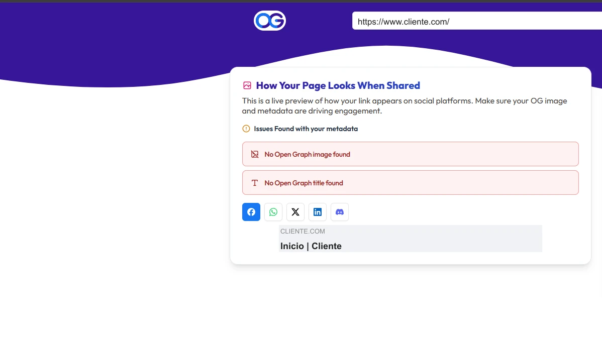
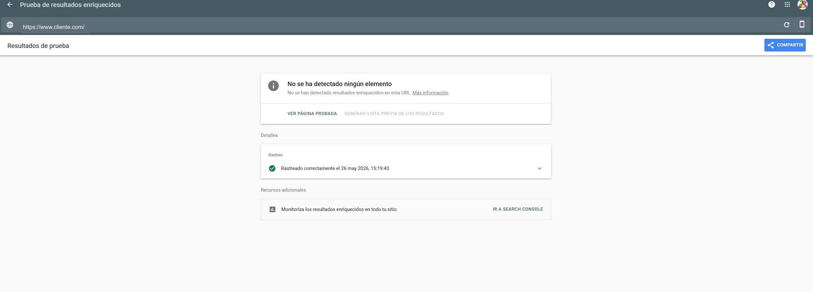

# Análisis SEO y Analytics — cliente.com

> **Fecha del análisis:** 26 de mayo de 2026
> **Herramienta principal:** Google Lighthouse 13.3.0 + inspección HTML fuente
> **URL analizada:** https://www.cliente.com/es/empresas

---

## 1. Resumen de Puntuaciones SEO (Lighthouse)

| Contexto    | Score SEO | Valoración                                         |
| ----------- | --------- | -------------------------------------------------- |
| **Desktop** | 🟢 100    | Sin problemas técnicos básicos detectados          |
| **Mobile**  | 🟢 100    | Ídem                                               |

> **Atención:** El score 100 de Lighthouse SEO solo valida SEO técnico básico (título, meta
> description, canonical, viewport, robots...). **No evalúa** la ausencia de datos estructurados,
> Open Graph, la calidad del contenido ni el estado de Analytics. Los problemas críticos de este
> informe no los detecta Lighthouse.

---

## 2. Estado de Analytics — Alerta Crítica

### 2.1 Universal Analytics deprecado

El sitio tiene implementado **Universal Analytics** con el identificador `UA-XXXXXXXXX-1`:

```html
<!-- Global site tag (gtag.js) - Google Analytics -->
<script async src="https://www.googletagmanager.com/gtag/js?id=UA-XXXXXXXXX-1"></script>
<script>
  window.dataLayer = window.dataLayer || [];
  function gtag(){dataLayer.push(arguments);}
  gtag('js', new Date());
  gtag('config', 'UA-XXXXXXXXX-1');
</script>
```

**Universal Analytics dejó de procesar datos el 1 de julio de 2023.** Desde esa fecha, el script
sigue presente en la web pero no recoge ningún dato. Google migró obligatoriamente a GA4 (prefijo
`G-`) en esa fecha.

### 2.2 Impacto real

| Situación                         | Consecuencia                                              |
| --------------------------------- | --------------------------------------------------------- |
| Sin datos desde jul. 2023         | ~3 años de tráfico, fuentes, conversiones y comportamiento de usuario perdidos |
| Sin datos de campañas             | No hay forma de evaluar el ROI de acciones de marketing pasadas |
| Sin datos históricos para el nuevo site | La migración no puede comparar tráfico antes/después |
| Decisiones sin base empírica      | No se sabe qué páginas funcionan, cuáles no, de dónde viene el tráfico |

### 2.3 ¿Tienen GA4 en paralelo?

**Sí.** El análisis de Coverage (`Coverage-20260526T142048.json`) confirma que GA4 está instalado
con la propiedad **`G-XXXXXXXXXX`**, aunque no es visible en el HTML fuente inspeccionado
manualmente (se inyecta vía Google Tag Manager).

| Propiedad            | ID                | Estado                                   |
| -------------------- | ----------------- | ---------------------------------------- |
| Universal Analytics  | `UA-XXXXXXXXX-1`  | Deprecado jul. 2023 — no procesa datos   |
| **GA4**              | `G-XXXXXXXXXX`   | **Activo** — instalado vía GTM           |

**El problema:** UA nunca fue eliminado. Ambas propiedades corren simultáneamente, cargando
**765 KB** de código de analítica por página (355 KB UA + 410 KB GA4). UA no aporta datos
desde julio de 2023 — es peso muerto.

**Acción pendiente:** Verificar en analytics.google.com que `G-XXXXXXXXXX` tiene datos activos
y desde qué fecha — requiere acceso a Google Analytics del cliente.

---

## 3. SEO Técnico — Lo que está bien

### 3.1 Elementos correctamente implementados

| Elemento                    | Valor detectado                                                                 | Estado |
| --------------------------- | ------------------------------------------------------------------------------- | ------ |
| `<title>`                   | `Empresas \| Cliente`                                                            | ✅ Correcto — formato "Página \| Marca" |
| `<meta name="description">` | `Soluciones avanzadas en la selección e incorporación de talento tecnológico + Externalización de procesos...` | ✅ Presente y descriptiva |
| `<link rel="canonical">`    | `https://www.cliente.com/es/empresas`                                           | ✅ Correcto |
| `<meta name="viewport">`    | `width=device-width, initial-scale=1.0`                                         | ✅ Correcto |
| `hreflang` es/en            | Implementado en `<link rel="alternate">` y en cabeceras HTTP                    | ✅ Correcto |
| `robots.txt`                | Detectado con plantilla estándar de Drupal                                      | ✅ Existe |
| HTTPS                       | Forzado via HSTS                                                                | ✅ Correcto |
| Estructura de URL           | `/es/empresas` — limpia, sin parámetros, con idioma                            | ✅ Correcto |

### 3.2 `<meta name="description">` — longitud

La descripción detectada tiene aproximadamente **155 caracteres**, dentro del rango óptimo
(120–160 caracteres) para mostrarse completa en los resultados de búsqueda de Google.

---

## 4. SEO Técnico — Problemas Detectados

### 4.1 Sin Open Graph (redes sociales)

No se detecta ninguna etiqueta Open Graph en el `<head>`:

```html
<!-- Ausente completamente: -->
<!-- <meta property="og:title" content="..."> -->
<!-- <meta property="og:description" content="..."> -->
<!-- <meta property="og:image" content="..."> -->
<!-- <meta property="og:url" content="..."> -->
<!-- <meta property="og:type" content="website"> -->
<!-- <meta property="og:site_name" content="Cliente"> -->
```

**Consecuencia:** Cuando alguien comparte un enlace de cliente.com en LinkedIn, Twitter/X,
WhatsApp o Slack, el preview generado automáticamente usa valores por defecto o queda en blanco:
sin imagen, sin título optimizado, sin descripción atractiva. Para una empresa de IT con presencia
en LinkedIn, esto es una oportunidad de visibilidad desperdiciada en cada enlace compartido.



### 4.2 Sin Twitter Cards

No se detecta ninguna etiqueta Twitter Card:

```html
<!-- Ausente: -->
<!-- <meta name="twitter:card" content="summary_large_image"> -->
<!-- <meta name="twitter:title" content="..."> -->
<!-- <meta name="twitter:description" content="..."> -->
<!-- <meta name="twitter:image" content="..."> -->
```

LinkedIn y X/Twitter son los canales principales de una empresa de recruiting tecnológico.
La ausencia de estas etiquetas reduce el impacto visual de cualquier publicación que enlace
al sitio.

### 4.3 Sin datos estructurados (JSON-LD / Schema.org)

No se detecta ningún bloque de datos estructurados en toda la página:

```html
<!-- Ausente completamente: -->
<!-- <script type="application/ld+json">...</script> -->
```

**Oportunidades perdidas por tipo de schema:**

| Schema                | Beneficio SEO                                                           | Aplica a |
| --------------------- | ----------------------------------------------------------------------- | -------- |
| `Organization`        | Rich result con logo, nombre, redes sociales y datos de contacto        | Home, todas las páginas |
| `WebSite`             | Activa el sitelinks searchbox en resultados de Google                   | Home |
| `BreadcrumbList`      | Muestra la ruta de navegación en los snippets de Google                 | Todas las páginas internas |
| `JobPosting`          | Rich result de oferta de empleo con fecha, salario, ubicación           | Página de empleo |
| `FAQPage`             | Acordeón de preguntas frecuentes directamente en los resultados de Google | Si existe sección FAQ |

La página de empleo (`/es/empleo` o similar) es especialmente relevante: Google muestra las
ofertas con `JobPosting` schema como rich results específicos en su motor de búsqueda de empleo,
con fecha, modalidad (presencial/remoto) y empresa. Sin este schema, las ofertas de Cliente son
invisibles en ese canal.



### 4.4 `<meta name="Generator">` expone el CMS

```html
<meta name="Generator" content="Drupal 8 (https://www.drupal.org)">
```

Esta etiqueta no penaliza directamente el SEO, pero expone la versión del CMS a cualquier
scraper o motor de análisis de vulnerabilidades. Combinado con el Drupal 8 EOL documentado en
`01-stack-tecnologico.md`, facilita el targeting automatizado. Se recomienda eliminarla.

### 4.5 Breadcrumb sin datos estructurados

El breadcrumb visual existe y está correctamente implementado en HTML semántico con
`role="navigation"`. Sin embargo, no tiene el schema `BreadcrumbList` en JSON-LD, por lo
que Google no puede mostrar la ruta de navegación en los snippets de búsqueda.

### 4.6 Core Web Vitals y penalización de ranking

Aunque este punto se detalla en `02-rendimiento.md`, tiene impacto SEO directo: desde mayo 2021,
Google utiliza Core Web Vitals como señal de ranking. Con un LCP móvil de 15.2 s (umbral "bueno":
< 2.5 s), el sitio está siendo penalizado activamente en búsquedas móviles frente a competidores
con mejores métricas.

---

## 5. Análisis del Sitemap

Drupal 8 genera `sitemap.xml` de forma nativa. No se ha podido inspeccionar el archivo directamente
en este análisis, pero se documentan los puntos a verificar con el cliente:

Verificaciones a realizar por el equipo de Cliente:

1. Confirmar que `https://www.cliente.com/sitemap.xml` existe y es accesible.
2. Verificar que el sitemap incluye todas las páginas indexables (es + en).
3. Verificar que no incluye páginas con `noindex` o páginas de administración Drupal.
4. Confirmar que el sitemap está declarado en `robots.txt`.
5. Verificar que el sitemap está enviado y procesado en Google Search Console.

---

## 6. Análisis de robots.txt

El archivo `robots.txt` sigue la plantilla estándar de Drupal, que bloquea correctamente las
rutas de administración:

```
# Disallow Drupal admin paths
Disallow: /admin/
Disallow: /user/
Disallow: /node/add
...
```

Puntos a verificar:

Verificaciones a realizar por el equipo de Cliente:

1. Que no bloquea accidentalmente páginas de contenido indexables.
2. Que incluye la directiva `Sitemap: https://www.cliente.com/sitemap.xml`.
3. Que la URL del sitemap usa `https://` (no `http://`).

---

## 7. Multiidioma y hreflang

| Elemento                    | Estado   | Detalle                                                    |
| --------------------------- | -------- | ---------------------------------------------------------- |
| `hreflang` en `<link>`      | ✅ Correcto | `/es/empresas` ↔ `/en/companies`                      |
| `hreflang` en HTTP headers  | ✅ Correcto | Implementado también a nivel de servidor                |
| `x-default` hreflang        | ⚠️ No detectado | Se recomienda añadir `hreflang="x-default"` apuntando a la versión principal |

El `hreflang x-default` indica a Google qué versión mostrar cuando no hay coincidencia de idioma.
Su ausencia no es un error crítico, pero es una buena práctica recomendada por Google.

---

## 8. Resumen de Hallazgos

| Problema                                        | Severidad       | Impacto SEO                           |
| ----------------------------------------------- | --------------- | ------------------------------------- |
| Universal Analytics deprecado — sin datos desde jul. 2023 | 🟠 Alto    | Script muerto (+355 KB) — GA4 activo vía GTM |
| Core Web Vitals en rojo (LCP 15.2 s móvil)      | 🔴 Crítico      | Penalización activa en ranking móvil  |
| Sin Open Graph tags                             | 🟠 Alto         | Previews en blanco en LinkedIn/redes  |
| Sin datos estructurados JSON-LD                 | 🟠 Alto         | Sin rich results, sin sitelinks, sin job listings |
| Sin Twitter Cards                               | 🟠 Medio        | Sin preview visual en X/Twitter       |
| `<meta name="Generator">` expone Drupal 8       | 🟡 Bajo         | Facilita targeting de vulnerabilidades |
| Breadcrumb sin schema `BreadcrumbList`          | 🟡 Bajo         | Sin ruta de navegación en snippets    |
| `hreflang x-default` ausente                    | 🟡 Bajo         | Orientación de idioma incompleta      |
| Sitemap y robots.txt — pendiente verificación   | ⚪ Info          | Requiere acceso directo al servidor   |

---

## 9. Recomendaciones

### Urgente (antes de cualquier otra acción)

1. **Eliminar el script de Universal Analytics** (`UA-XXXXXXXXX-1`) — GA4 ya está instalado y activo
   vía GTM (`G-XXXXXXXXXX`). UA no procesa datos desde julio de 2023 y añade 355 KB de peso muerto
   en cada carga. Verificar en `analytics.google.com` desde qué fecha tiene datos GA4 y que los
   eventos clave (formularios, clics, páginas de empleo) están configurados correctamente.

### A implementar en el sitio actual (sin migración)

2. Añadir tags **Open Graph** a todas las páginas (título, descripción, imagen, URL, tipo).
3. Añadir **Twitter Cards** (`summary_large_image` para páginas con imagen destacada).
4. Implementar schema **`Organization`** y **`WebSite`** en JSON-LD en la home.
5. Implementar schema **`BreadcrumbList`** en todas las páginas internas.
6. Eliminar `<meta name="Generator">` con un hook de Drupal.
7. Añadir `hreflang="x-default"`.

### En el nuevo sitio Astro (solución definitiva)

Todos estos elementos se implementan de forma sistemática durante la construcción:
- Componente `<SEO>` o `<Head>` centralizado con Open Graph, Twitter Cards y canonical en cada página.
- JSON-LD generado automáticamente desde los datos de cada página/colección.
- GA4 integrado desde el primer día (cero pérdida de datos post-lanzamiento).
- Sin `<meta name="Generator">` — Astro no lo añade por defecto.
- Integración `@astrojs/sitemap` para generación automática del sitemap en cada build.
